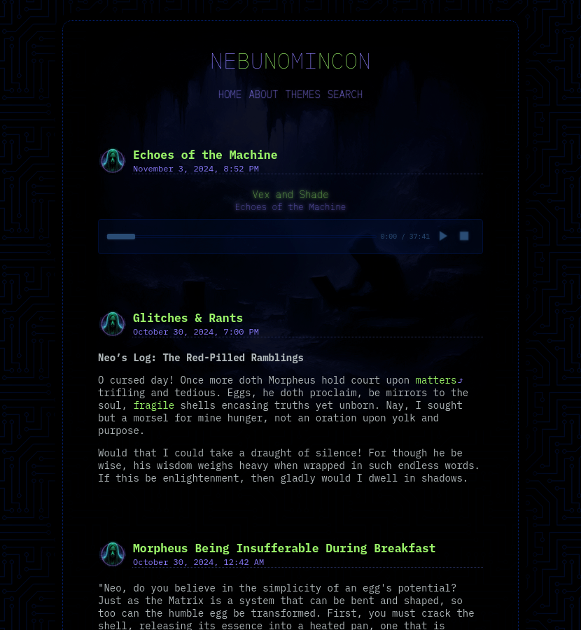

<div align="center">
    


</div>
# PHP Blog Script

This is a simple PHP blog script that parses Markdown posts with YAML front matter for metadata, allowing you to group posts by year and month in subfolders. It also supports static pages, a clean URL structure, and automatic slug generation. The script uses [Parsedown](https://parsedown.org/) for Markdown parsing and a custom YAML parser for front matter.

## Features

- Posts are written in Markdown with optional YAML front matter for metadata.
- Group blog posts by year and month in subfolders for organized file structure.
- Slug generation for clean URLs based on the post title or filename.
- Safe file path handling to avoid directory traversal vulnerabilities.
- Static page support for `/pages` directory.
- Markdown parsing using Parsedown.
- Custom YAML parser for post metadata.
- Supports custom date formatting and multiple formats for flexibility.
- Handles special `<!--more-->` tag for controlling content display.

## File Structure

    /posts/ ├── YYYY/ │ └── MM/ │ └── post-slug.md /pages/ └── about.md /includes/ ├── Parsedown.php └── YAMLParser.php post.php header.php footer.php


- `posts/`: Contains blog posts grouped by year (`YYYY`) and month (`MM`).
- `pages/`: Contains static pages like "about.md".
- `Parsedown.php`: Handles Markdown parsing.
- `YAMLParser.php`: Parses YAML front matter.
- `post.php`: Main blog script that handles rendering both posts and static pages.
- `search.php`: Text search of posts via a search form.

## Usage

1. **Clone the repository**:
   ```bash
   git clone https://github.com/tacojones/blogg.git

2. **Setup posts and pages**:

 - Add your blog posts in the /posts/YYYY/MM/ folder structure. Each post should be a .md file with optional YAML front matter for metadata (e.g., title, date, slug).
 - Add any static pages in the /pages/ folder.

Example post format:
```markdown
---
title: Volkor X
date: 2024-10-29 20:20:06
---
Post is here in Markdown and HTML.
```

3. **Access posts and pages**:

 - Posts are accessible via post.php?slug=post-slug.
 - Pages are accessible via post.php?page=page-filename.

4. **Customizing date formats**: The script supports multiple date formats for flexibility in displaying post dates. Modify this section in post.php to add or change formats.



Example script to post to the blog. Includes metadata fetching from article URLs.

```php
<?php
// Function to extract metadata, including Open Graph (Facebook)
function get_metadata($url) {
    $metadata = [];
    $context = stream_context_create(['http' => ['header' => 'User-Agent: Mozilla/5.0']]);
    $html = @file_get_contents($url, false, $context);

    if ($html === false) {
        return null;
    }

    // Load the HTML content
    libxml_use_internal_errors(true);
    $dom = new DOMDocument();
    @$dom->loadHTML($html); // Suppress warnings with @
    libxml_clear_errors();

    // Extract Open Graph meta tags for Facebook posts
    $metaTags = $dom->getElementsByTagName('meta');
    foreach ($metaTags as $metaTag) {
        if ($metaTag->getAttribute('property') == 'og:title') {
            $metadata['title'] = $metaTag->getAttribute('content');
        }
        if ($metaTag->getAttribute('property') == 'og:description') {
            $metadata['description'] = $metaTag->getAttribute('content');
        }
        if ($metaTag->getAttribute('property') == 'og:image') {
            $metadata['image'] = $metaTag->getAttribute('content');
        }
    }

    return $metadata;
}

// Handle metadata fetching via AJAX
if (isset($_POST['fetch_metadata'])) {
    $link = filter_var(trim($_POST['article_link']), FILTER_VALIDATE_URL);
    if ($link) {
        $metadata = get_metadata($link);
        if ($metadata) {
            $title = html_entity_decode($metadata['title'] ?? '', ENT_QUOTES, 'UTF-8');
            $title = strip_tags($title);
            $title = trim($title);
            $markdown = "## " . $title . "\n";

            if (isset($metadata['description'])) {
                $description = html_entity_decode($metadata['description'], ENT_QUOTES, 'UTF-8');
                $description = strip_tags($description);
                $description = trim($description);
                $markdown .= $description . "\n\n";
            }
            if (isset($metadata['image'])) {
                $markdown .= " . ")\n\n";
            }

            echo json_encode(['success' => true, 'title' => $title, 'markdown' => $markdown]);
        } else {
            echo json_encode(['success' => false, 'error' => 'Could not fetch metadata']);
        }
    } else {
        echo json_encode(['success' => false, 'error' => 'Invalid URL']);
    }
    exit();
}

// Save the markdown file after form submission
if ($_SERVER['REQUEST_METHOD'] === 'POST' && !isset($_POST['fetch_metadata'])) {
    $title = $_POST['post_title'] ?? '';
    $title = html_entity_decode($title, ENT_QUOTES, 'UTF-8');
    $title = strip_tags($title); // Sanitize title
    $title = trim($title);
    $title = preg_replace('/\p{C}+/u', '', $title); // Removes invisible characters
    $markdown_content = $_POST['markdown'] ?? '';
    $article_link = $_POST['article_link'] ?? '';
    $date = date('Y-m-d H:i:s'); // Include time in the date

    // Sanitize and process the article link
    $article_link = filter_var(trim($article_link), FILTER_VALIDATE_URL);
    $article_link_markdown = '';
    if ($article_link) {
        $parsed_url = parse_url($article_link);
        $domain = $parsed_url['host']; // get host

        // Remove 'www.' if present
        $domain = preg_replace('/^www\./', '', $domain);

        // Build the markdown link
        $article_link_markdown = "[Source: $domain]($article_link)";
    }

    // Generate a clean, human-readable filename with the first two words of the title
    $title_words = preg_split('/\s+/', trim($title));
    $filename_part = strtolower(preg_replace('/[^a-zA-Z0-9-_]/', '', implode('_', array_slice($title_words, 0, 2))));
    $filename_date = date('Y-m-d'); // Use date without time for filename
    $filename = $filename_date . '-' . $filename_part . ".md";

    // Create year/month directory structure
    $year = date('Y');
    $month = date('m');
    $directory = "posts/$year/$month";

    // Ensure the directory exists
    if (!is_dir($directory)) {
        mkdir($directory, 0755, true);
    }

    // Generate the Markdown content in the required format
    $markdown = "---\n";
    $markdown .= "title: " . htmlspecialchars($title, ENT_QUOTES, 'UTF-8') . "\n";
    $markdown .= "date: " . $date . "\n";
    $markdown .= "---\n\n";
    $markdown .= $markdown_content;

    if (!empty($article_link_markdown)) {
        $html_content = "\n\n" . htmlspecialchars("<div class=\"source_link\">" . $article_link_markdown . "</div>", ENT_QUOTES, 'UTF-8');
        $markdown .= $html_content;
    }

    // Save the markdown file
    $file_path = "$directory/$filename";
    if (file_put_contents($file_path, $markdown) !== false) {
        // Redirect to index.php
        header('Location: index.php');
        exit();
    } else {
        echo "Error saving markdown file.";
    }
    exit();
}

// Include header
include 'header.php';
?>

<style>
    /* [Your existing CSS styles] */

    .article-content p:last-child {
        text-align: right;
        margin-top: 20px;
        font-size: 0.9em;
        color: #888;
    }

    .article-content p:last-child a {
        color: #888;
        text-decoration: none;
    }

    .article-content p:last-child a:hover {
        color: #555;
        text-decoration: underline;
    }
</style>

<script>
    function fetchMetadata() {
        const articleLink = document.getElementById('article_link').value;
        const errorMessage = document.getElementById('error_message');
        const markdownField = document.getElementById('markdown');
        const titleField = document.getElementById('post_title');

        fetch('', {
            method: 'POST',
            headers: {
                'Content-Type': 'application/x-www-form-urlencoded'
            },
            body: new URLSearchParams({
                fetch_metadata: true,
                article_link: articleLink
            })
        })
        .then(response => response.json())
        .then(data => {
            if (data.success) {
                markdownField.value += data.markdown;
                titleField.value = data.title;
                errorMessage.textContent = '';
            } else {
                errorMessage.textContent = data.error;
            }
        })
        .catch(err => {
            errorMessage.textContent = 'An error occurred';
        });
    }
</script>
</head>
<body>
<div class="post">
<form method="POST" action="">
    <label for="post_title">Post Title:</label>
    <input type="text" name="post_title" id="post_title" required>

    <label for="markdown">Content:</label>
    <textarea name="markdown" id="markdown" rows="10" required></textarea>

    <div align="right"><button type="submit">POST</button></div>

    <label for="article_link">Article Link: (optional)</label> <div id="error_message" class="error"></div>
    <input type="text" name="article_link" id="article_link">
    <div align="right"><button type="button" onclick="fetchMetadata()">Fetch Metadata</button></div>
</form>
</div>
<?php
include 'footer.php';
?>
```


## Security

1. **Safe File Path Validation**  
   Uses a `safeFilePath()` helper function to validate requested file paths. This prevents directory traversal attacks by removing any potentially malicious characters and verifying that paths remain within the designated `/posts/` directory.

2. **URL-Safe Slug Generation**  
   The `generateSlug()` function sanitizes titles to create URL-friendly slugs by removing any non-alphanumeric characters and hyphens. This prevents accidental or malicious URL injection.

3. **HTML Escaping for User Input**  
   All user-inputted search queries are sanitized with `htmlspecialchars()` to prevent Cross-Site Scripting (XSS) attacks when displaying search results. This ensures any special characters in the query are safely escaped in HTML output.

4. **Sanitized Output for Post Titles and Dates**  
   Post metadata like titles and dates are also sanitized before outputting, reducing the risk of unintended HTML or script injection from YAML front matter.

5. **Secure Directories and Grouped File Access**  
   The script searches only within specific subfolders, organized by year and month, making it more secure by limiting the scope of the search to a structured set of directories.

## Customization

 - You can modify the header.php and footer.php files to customize the layout and styling of the blog.

## License

This project is open source and available under the MIT License.

## Contributing

Contributions, issues, and feature requests are welcome! Feel free to check the [issues page](https://github.com/tacojones/blogg/issues).


