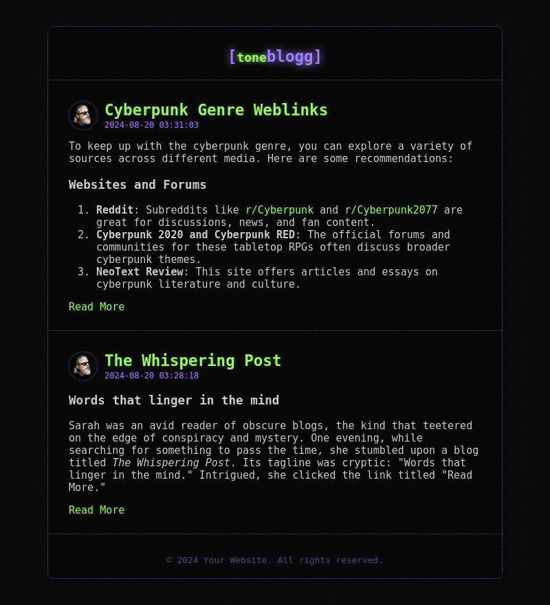
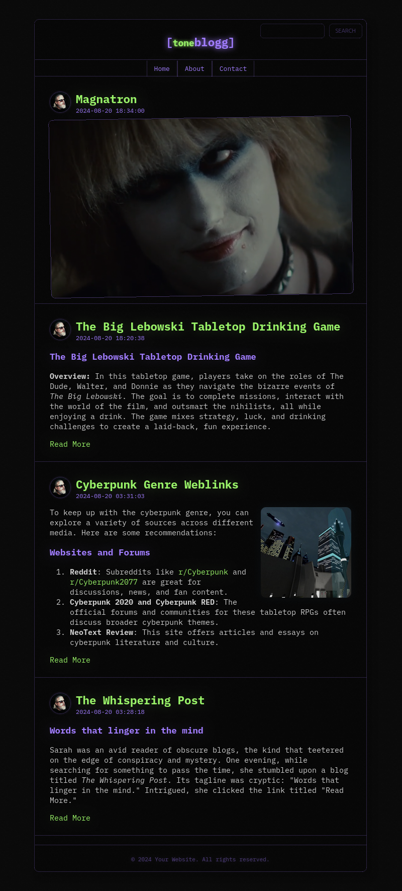

# blogg: A Flat-File Blog Script

This is a simple flat-file blog script written in PHP. It allows users to display static blog entries with subjects, date and time stamps, and supports pagination and markdown.

## Features

- **Flat-File Storage**: Posts are stored as individual text files in a directory.
- **Markdown**: blogg features markdown support with Parsedown.php.
- **Pagination**: blogg supports pagination for browsing posts.
- **Read More**: blogg supports Truncation of long articles with a Read More link.
- **Search**: blogg supports searching via a search form.

## License

This project is licensed under the MIT License. See the LICENSE file for more details.
