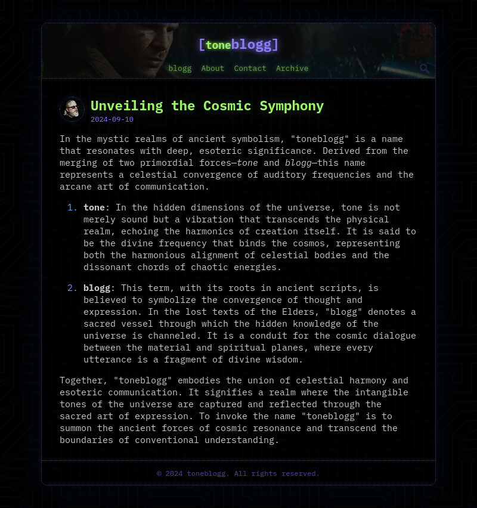
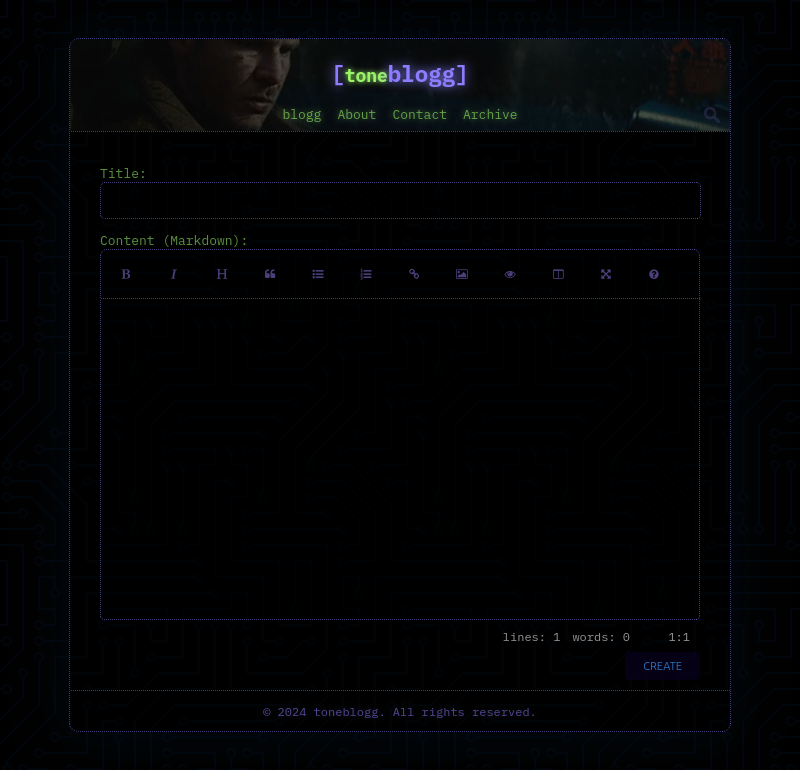
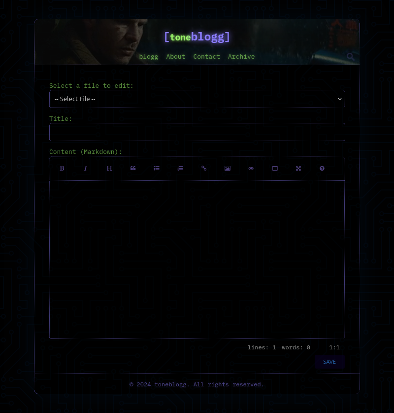

<p style="text-align:center">


 </p>

# blogg: A Flat-File Blog Script

This is a simple flat-file blog script written in PHP. It allows users to display static blog entries with subjects, date and time stamps, and supports markdown, pagination and search. I wanted a simple, portable and searchable database of blog posts and couldn't find a solution, so I made one with everything I needed and nothing more.

## Features

- **Flat-File Storage**: Posts are stored as individual text files in a directory
- **Markdown**: blogg features markdown support with Parsedown
- **Pagination**: blogg supports pagination for browsing posts
- **Read More**: blogg supports truncation with a Read More link for long articles
- **Search**: blogg supports text searches via a search form
- **Code Highlighting**: blogg supports markdown syntax highlighting with highlight.js



An example of **post.php**, with EasyMDE rich text integration and Markdown support. Obviously needs to be behind a password prompt if it's on your server.

```php
<?php
// Define the directory where posts will be saved
define('POSTS_DIR', 'posts');

if ($_SERVER['REQUEST_METHOD'] === 'POST') {
    // Get the form data
    $title = trim($_POST['title']);
    $content = trim($_POST['content']);
    $date = date('Y-m-d'); // Use the current date

    // Validate the input
    if (empty($title) || empty($content)) {
        $error = 'Title and content are required.';
    } else {
        // Sanitize the title to create a safe filename
        $safeTitle = preg_replace('/[^A-Za-z0-9-]+/', '-', strtolower($title));
        $safeTitle = trim($safeTitle, '-');
        $filename = "$date-$safeTitle.md";

        // Ensure the filename is unique by adding a timestamp if it already exists
        if (file_exists(POSTS_DIR . '/' . $filename)) {
            $filename = "$date-$safeTitle-" . time() . '.md';
        }

        // Create the markdown content with YAML front matter
        $markdown = "---\n";
        $markdown .= "title: \"$title\"\n";
        $markdown .= "date: \"$date\"\n";
        $markdown .= "---\n\n";
        $markdown .= $content;

        // Save the markdown file
        if (file_put_contents(POSTS_DIR . '/' . $filename, $markdown)) {
            header('Location: index.php');
            exit;
        } else {
            $error = 'Failed to save the post. Please check the permissions.';
        }
    }
}
?>

<?php include 'includes/header.php'; ?>

<link rel="stylesheet" href="https://cdn.jsdelivr.net/npm/easymde/dist/easymde.min.css">
<style>
    .CodeMirror {
        background-color: #00000050;
        color: #fff !important;
        border: 1px dotted #8c7dff77 !important;
        border-top: 0 !important;
    }

    input {
        caret-color: #8c7dff !important;
}
    .editor-toolbar {
        border: none;
        background: #00000050;
        border: 1px dotted #8c7dff77;
        border-top-right-radius: 6px;
        border-top-left-radius: 6px;
        overflow: hidden;
    }
    .editor-toolbar a,
    .editor-toolbar button {
        margin-right: 18px;
        color: #4d3f7b;
    }
    .editor-toolbar button:hover {
        background: #0a0124;
        border: 0;
    }
    .editor-toolbar i.separator {
        display: none;
    }
    .EasyMDEContainer .cm-s-easymde .CodeMirror-cursor {
        border-color: #8c7dff;
    }
    .EasyMDEContainer .CodeMirror-fullscreen {
        background: #000;
    }
    .editor-toolbar.fullscreen {
        background: #000;
    }
    .editor-preview {
        background: #000;
        border: 1px dotted #8c7dff77;
    }
    button {text-shadow: none;}
    button:hover {text-shadow: none;}
</style>

<div class="post">
    <?php if (!empty($error)): ?>
        <div class="error"><?= htmlspecialchars($error) ?></div>
    <?php endif; ?>

    <form action="" method="POST">
        <label for="title">Title:</label>
        <input style="width: 579px" type="text" id="title" name="title" required>
        <label for="content">Content (Markdown):</label>
        <textarea id="markdown-editor" name="content"></textarea>
        <div align="right"><button type="submit">Create</button></div>
    </form>
</div>

<script src="https://cdn.jsdelivr.net/npm/easymde/dist/easymde.min.js"></script>
<script>
    const easyMDE = new EasyMDE({ element: document.getElementById('markdown-editor') });
</script>

<?php include 'includes/footer.php'; ?>

```


And a post editor with **edit.php**

```php

<?php
// Define the directory where posts will be saved
define('POSTS_DIR', 'posts');

// Initialize variables
$title = '';
$content = '';
$error = '';
$filename = '';

// Check if a file is selected for editing
if (isset($_GET['file'])) {
    $filename = basename($_GET['file']); // Prevent directory traversal
    $filePath = POSTS_DIR . '/' . $filename;

    if (file_exists($filePath)) {
        // Read the content of the file
        $fileContent = file_get_contents($filePath);

        // Check if file content was successfully retrieved
        if ($fileContent === false) {
            $error = 'Failed to read the file content.';
        } else {
            // Extract YAML front matter
            preg_match('/---(.*?)---(.*)/s', $fileContent, $matches);

            // If YAML front matter is found, extract title and content
            if (count($matches) === 3) {
                $frontMatter = parseFrontMatter($matches[1]);
                $title = $frontMatter['title'] ?? '';
                $content = trim($matches[2]);
            } else {
                $content = $fileContent;
            }
        }
    } else {
        $error = 'File not found.';
    }
}

// Handle the delete request
if ($_SERVER['REQUEST_METHOD'] === 'POST' && isset($_POST['delete']) && !empty($_POST['filename'])) {
    $fileToDelete = POSTS_DIR . '/' . basename($_POST['filename']);

    // Check if the file exists before deleting
    if (file_exists($fileToDelete)) {
        if (unlink($fileToDelete)) {
            header('Location: index.php');
            exit;
        } else {
            $error = 'Failed to delete the file.';
        }
    } else {
        $error = 'File not found.';
    }
}

// Function to get all .md files sorted by modified date descending
function getSortedFiles($directory)
{
    // Get all markdown files in the directory
    $files = glob("$directory/*.md");

    // Create an array to hold filenames and their modified times
    $fileDates = [];

    // Populate the array with filenames and their modification times
    foreach ($files as $file) {
        $fileDates[$file] = filemtime($file);
    }

    // Sort the files by modification time in descending order
    arsort($fileDates);

    // Return only the filenames in the sorted order
    return array_keys($fileDates);
}

// Function to manually parse YAML front matter
function parseFrontMatter($yaml)
{
    $lines = explode("\n", trim($yaml));
    $result = [];

    foreach ($lines as $line) {
        if (strpos($line, ':') !== false) {
            [$key, $value] = explode(':', $line, 2);
            $result[trim($key)] = trim($value, " \"");
        }
    }

    return $result;
}

// Handling POST request to save the file
if ($_SERVER['REQUEST_METHOD'] === 'POST' && isset($_POST['save'])) {
    // Get the form data
    $title = trim($_POST['title']);
    $content = trim($_POST['content']);
    $filename = trim($_POST['filename']) ?: date('Y-m-d') . '-' . preg_replace('/[^A-Za-z0-9-]+/', '-', strtolower($title)) . '.md';
    $filePath = POSTS_DIR . '/' . $filename;

    // Validate the input
    if (empty($title) || empty($content)) {
        $error = 'Title and content are required.';
    } else {
        // Preserve original modified time
        $originalModifiedTime = file_exists($filePath) ? filemtime($filePath) : false;

        // Create the markdown content with YAML front matter
        $markdown = "---\n";
        $markdown .= "title: \"$title\"\n";
        $markdown .= "date: \"" . date('Y-m-d') . "\"\n";
        $markdown .= "---\n\n";
        $markdown .= $content;

        // Save the markdown file
        if (file_put_contents($filePath, $markdown)) {
            // Restore the original modified time if it exists
            if ($originalModifiedTime !== false) {
                touch($filePath, $originalModifiedTime);
            }
            header('Location: index.php');
            exit;
        } else {
            $error = 'Failed to save the post. Please check the permissions.';
        }
    }
}
?>

<?php include 'includes/header.php'; ?>

<link rel="stylesheet" href="https://cdn.jsdelivr.net/npm/easymde/dist/easymde.min.css">
<style>
    .CodeMirror {
        background-color: #00000050;
        color: #ffffff99 !important;
        font-family: 'IBM Plex Mono', monospace !important;
        font-size: 14px !important;
        border: 1px dotted #8c7dff77 !important;
        border-top: 0 !important;
    }

    input {
        caret-color: #8c7dff !important;
    }
    .editor-toolbar {
        border: none;
        background: #00000050;
        border: 1px dotted #8c7dff77;
        border-top-right-radius: 6px;
        border-top-left-radius: 6px;
        overflow: hidden;
    }
    .editor-toolbar a,
    .editor-toolbar button {
        margin-right: 18px;
        color: #4d3f7b;
    }
    .editor-toolbar button:hover {
        background: #4d3f7b25;
        border: 0;
    }
    .editor-toolbar i.separator {
        display: none;
    }
    .EasyMDEContainer .cm-s-easymde .CodeMirror-cursor {
        border-color: #8c7dff;
    }
    .EasyMDEContainer .CodeMirror-fullscreen {
        background: #000;
    }
    .editor-toolbar.fullscreen {
        background: #000;
    }
    .editor-preview {
        background: #000;
        border: 1px dotted #8c7dff77;
    }
    button {text-shadow: none;}
    button:hover {text-shadow: none;}
</style>

<div class="post">
    <?php if (!empty($error)): ?>
        <div class="error"><?= htmlspecialchars($error) ?></div>
    <?php endif; ?>

    <!-- File selector -->
    <form action="" method="GET">
        <label for="file">Select a file to edit:</label>
        <select name="file" id="file" onchange="this.form.submit()">
            <option value="">-- Select File --</option>
        <?php
        // Get the sorted files from the posts directory
        $sortedFiles = getSortedFiles(POSTS_DIR);

        // Display each file in the dropdown
        foreach ($sortedFiles as $file) {
            $fileName = basename($file);
            $selected = ($fileName === $filename) ? 'selected' : '';
            echo "<option value=\"$fileName\" $selected>$fileName</option>";
        }
        ?>
        </select>
    </form>

<form action="" method="POST" onsubmit="return confirmDelete(event);">
    <input type="hidden" name="filename" value="<?= htmlspecialchars($filename) ?>">
    <label for="title">Title:</label>
    <input style="width: 579px" type="text" id="title" name="title" value="<?= htmlspecialchars($title) ?>" required>
    <label for="content">Content (Markdown):</label>
    <textarea id="markdown-editor" name="content"><?= htmlspecialchars($content) ?></textarea>
    <div align="right">
        <button type="submit" name="save">Save</button>
        <?php if (!empty($filename)): ?>
            <button type="submit" name="delete" class="delete-button">Delete</button>
        <?php endif; ?>
    </div>
</form>

<script src="https://cdn.jsdelivr.net/npm/easymde/dist/easymde.min.js"></script>
<script>
    const easyMDE = new EasyMDE({ element: document.getElementById('markdown-editor') });
    easyMDE.value(`<?= addslashes($content) ?>`);

    function confirmDelete(event) {
        // Check if the delete button was clicked
        if (event.submitter && event.submitter.name === 'delete') {
            return confirm('Are you sure you want to delete this post? This action cannot be undone.');
        }
        return true;
    }
</script>


<?php include 'includes/footer.php'; ?>

```



## License

This project is licensed under the MIT License. See the LICENSE file for more details.
